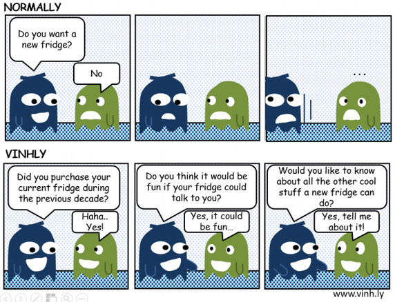

这里有个让别人同意你观点的技巧。这个方法是有科学依据的：

它被称为「梯式同意」（Yes-Ladder）—— 只要你知道自己在做什么，并且有个让人稍微感兴趣的理由，你可以在任何事情上面让别人同意你。

它适用于许多领域——如市场营销、销售，包括约会。

下面是销售领域很好的一个例子：



你可以从那里继续——这个人已经被吸引住了。

**技巧是要先谈你认定他们一定会同意的事情。**然后说一些很难否定的事情。然后，你可以问一下他人的喜好或是一些十分清楚的问题。最后，要求你真正想要的，你很可能得到一个肯定的回答。

下面是约会的例子：

```
“你是个随性的人吗？” 是的

“你是一个爱冒险的人吗？” 当然

“你曾经做过一些小疯狂的事情吗？” 有啊！

“你和一个刚刚认识的人有过亲密行为吗？” 我想是的。

“如果错过了你不会后悔吗？” 可能吧。

“你这周有时间吗？” 有啊！

“去喝一杯呗？ 好的！
```

你得到了一个约会:)

（这些问题都是我随机举的例子，可以有一千种不同的问题）

想知道它是如何奏效的么？ 下面是这个思维技巧背后的科学原理：

大脑有一种情绪反馈回路，它使你寻找感觉和刺激——无论是好还是坏——以使你可以将当前的情绪维持下去，并且避免任何会令你情绪变化的事情。这甚至适用于说“是”和“否”。

有一项研究叫[《三思而行——纯粹同意（Mere agreement）：基于相似性的说服机制》](http://www.sciencedirect.com/science/article/pii/S0167811610000182)，2010 年发表在《国际市场营销研究》上，其中写到：

> 本论文表明，请求者通过在一些列与要求不相关的问题上取得同意，可以增加人们服从的频率。我们称此为「纯粹同意效应」（mere-agreement effect），并提供一个两个步骤的基于相似性的机制来解释它。
>
> 通过五个案例的研究，我们发现通过巧妙的诱导出“纯粹同意”效应，会使受试者将实验者的观点看成与自己的。这反过来又增加了对于来自同一实验者的要求的顺从频率。我们做了对比实验：当诱导与实验者的要求违背时，或当请求是由其他人提出，或是当诱导显得特别突兀时，受试者的服从效应都会降低。我们也在实际中验证了「纯粹同意技巧」。我们探讨「纯粹同意效应」如何能被广泛使用来促进合作，以及如何应用到销售当中。

相当惊人，对不对？

你已经在几个观点上取得了别人的同意，那么他们更愿意同意你下一件观点，尽管它与之前的话题毫不相关。

觉得自己是个绝地武士了吗？ :) 这个技巧并不限于销售或约会。例如，假设你朋友想请你帮他粉刷房子。

当他见到你，和你聊天时，如果他所主导的谈话方向是正确的，问了很多得到肯定回答的问题——稍后当他请你帮他刷房子时，你更有可能答应。

不要仅从字面意义上理解这个例子，想象所有的可能性。
