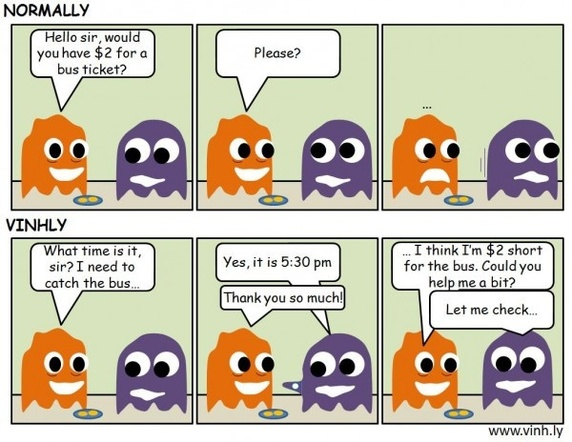

**互惠是一条心理学规则，它解释了他人为你付出时你的债务感（feeling of obligation）。**显而易见，如果朋友在晚饭时为你买单了，下一次应该你请客。但是这是为什么呢？

事实证明，互惠一条基本的社会规范。如果好的行为不受到奖励，坏的行为不被惩罚，社会将很难运行。可是，这样一条强力的规则，也为人们操作提供了一定空间。

这种强大的债务感（feelings of obligation），可以被小恩小惠触发。

我举了一个很著名的例子：

> Hare Krishna 宗教在 60 年代和 70 年代人气暴涨，有证据表明 ，他们的成功至少部分是由于：他们先会赠送陌生人鲜花，然后要求捐赠。

你也可以将此作为你的优势。在提要求之前先给你的目标一点小礼物，你更可能获得成功。这条规则在接近陌生人时尤其有用——带上一小束鲜花，你可能成为组织中最出色的销售人员。

更进一步，在最初的请求被同意后（因为我们的债务感），我们已经取得了认可，这时候我们就可以使用其他人提到的「得寸进尺法」了（the foot-in-the-door technique）。

其基本思路是，一旦有人满足了你一个愿望，他们更可能同意你更多的要求。通过结合互惠原则与得寸进尺法，一点小礼物加上聪明的策略能够取得巨大的成功。
